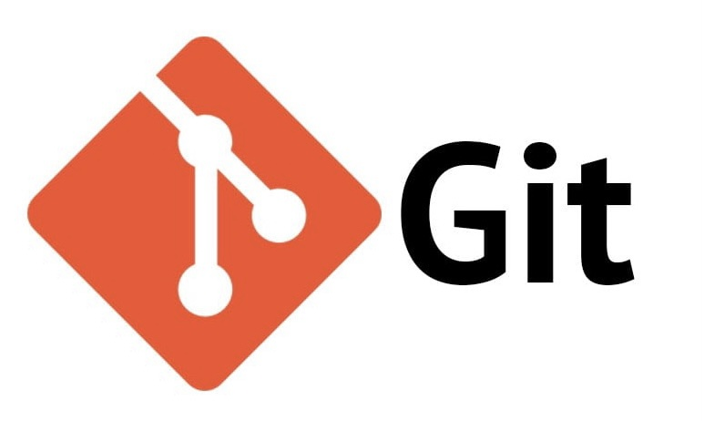

# 

**How I learn to work with git**

---

## Branch Operations

Technically, you have to make every modification on the branch and merge it to the main branch. You can create a branch on the current branch.

### Commands

To create a new branch:

```shell
git branch <branch_name>
```

To change to a specific branch:

```shell
git checkout <branch_name>
```

To delete a branch from **local repo**:

```shell
git branch -d <branch_name1> <branch_name2> ...
```

To fetch a remote branch to the local repo:

```shell
git fetch origin <remote_branch_name>:<local_branch_name>
```

To push a local branch to the remote branch:

```shell
git push origin <local_branch>:<remote_branch>
```

---

## Merging Operations

There are two ways to merge the branch to the local branch:

- Merge the branch to the main branch locally and push the main to the remote repo
- Push all the commits to the remote repo and send a pull request (recommended if I am not the owner of the repo)

### Commands

To merge a local branch to the local main branch:

```shell
git checkout <branch1> ## switch to the main branch first
git merge <branch2> ## Merge branch2 to the branch1
```